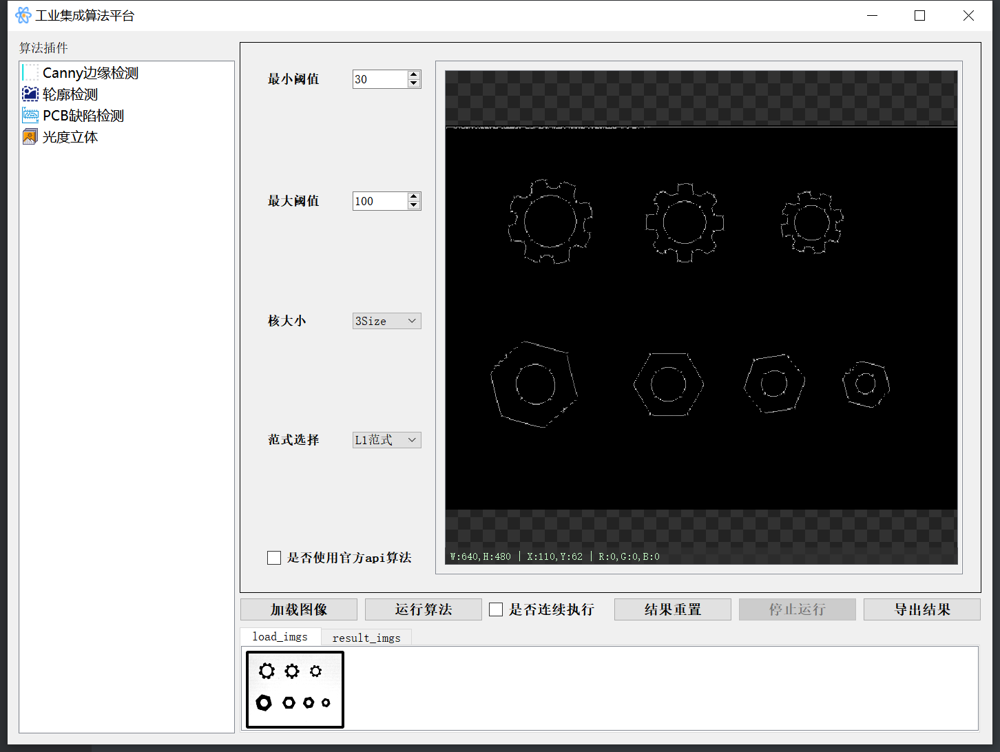
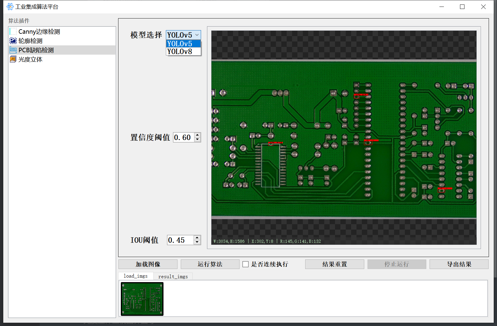
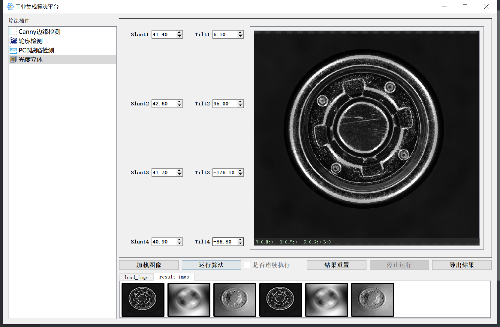
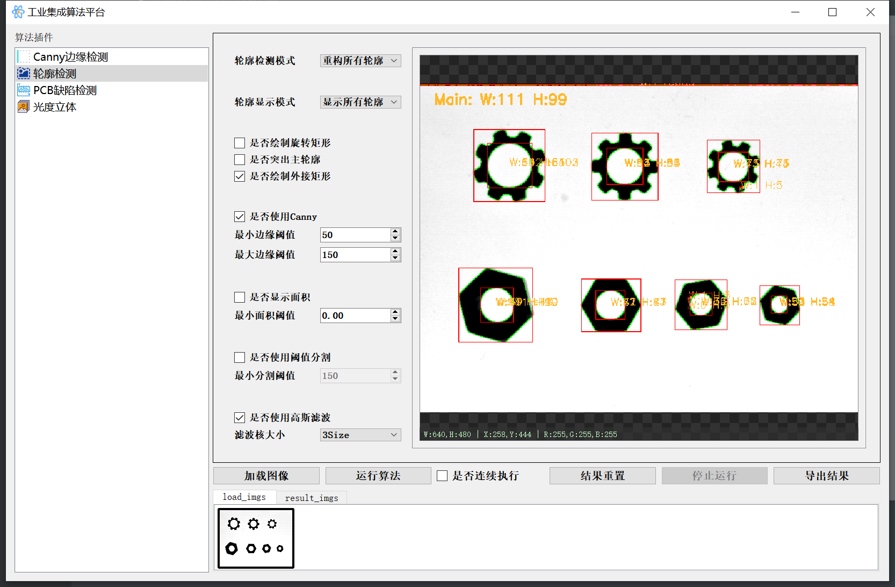

# 工业视觉算法平台

演示视频：https://www.bilibili.com/video/BV1qXbmzWEuc/

`这是一个基于 Qt + OpenCV + PyTorch 的图像算法集成平台，支持图像预处理、三维重建、目标检测、轮廓分析等常见工业视觉任务。`

## 📌 功能模块：

1. **图像预处理：Canny 边缘检测**
   - 支持阈值、范式可调，Canny 算子自定义实现
   - 实时显示边缘检测结果
2. **光度立体重建（Shape from Shading）**
   - 支持四图像输入，设置 slant / tilt 参数
   - 输出梯度图、反照率图、高度图等可视化结果
3. **PCB 缺陷检测（YOLOv5 / YOLOv8 支持）**
   - 支持模型热切换、设置 IoU/Conf 阈值
   - 自动绘制检测框、置信度，保存检测记录
4. **轮廓检测分析**
   - 支持多种二值化方式（Canny / 阈值）
   - 可选滤波操作，提取轮廓及其属性（面积、外接矩形、长宽等）
   - 支持图像与分析结果一键保存
5. 🌀 **批量处理支持**
   - 除光度立体外，平台支持图像批量加载与连续执行，适合算法调试及效率测试
   - 用户勾选“连续执行”后，自动依次对每张图像执行所选算法并保存结果

## 🔧 技术栈：

- `C++ / Python` 混合编程
- `OpenCV` 图像处理 (需4.8及以上)
- `PyTorch` 深度学习模型推理（YOLOv5/YOLOv8）
- `Qt` 图形界面开发

## 📸 界面预览：

- 边缘检测界面

  

- YOLO 检测结果界面

  

- 光度立体三视图界面等

  

- 轮廓检测界面

  

